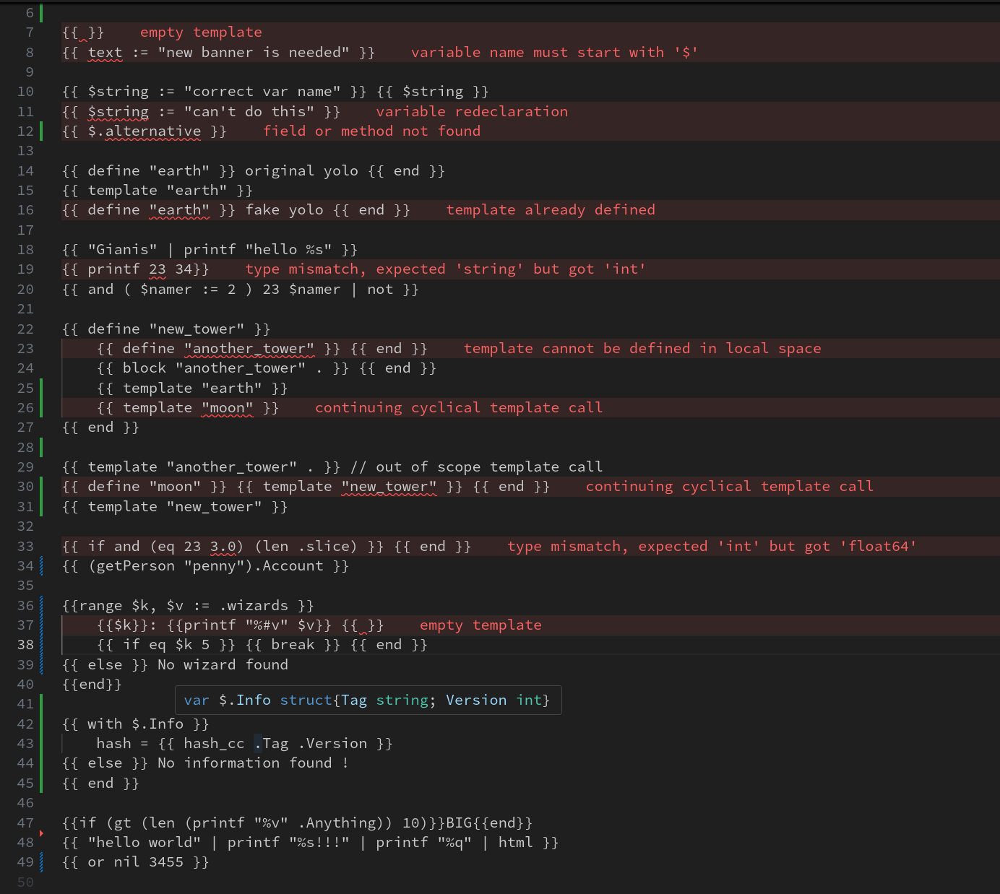

# Go Template LSP

Go template is incredible. But the lack of editor/IDE support is a crime. This makes the feedback loop between coding and bug detection a real challenge.

This LSP aims to tackle that issue. From now on, instantaneous diagnostics and type checking are a breeze.

You will never again need to download a dependency to replace the good and reliable standard `text/template` and `html/template` packages. Build with confidence :

- SSR web apps
- Static sites (Hugo, etc.)  
- Any project using Go templates



## Features

- Diagnostics
- Type system
- Go To Definition
- Hover
- Folding Range
- Dependency analysis of Template call

## Installation

Afther installing the vscode extension, it is imperative to install the LSP next. Execute the command below in your terminal:

```bash
go install github.com/yayolande/go-template-lsp@latest
```

To learn more about other installation procedure, visit the [official repository](https://github.com/yayolande/go-template-lsp)
Similarly, to better learn the inner working of the type system, follow this small [tutorial](https://github.com/yayolande/go-template-lsp#usage)

