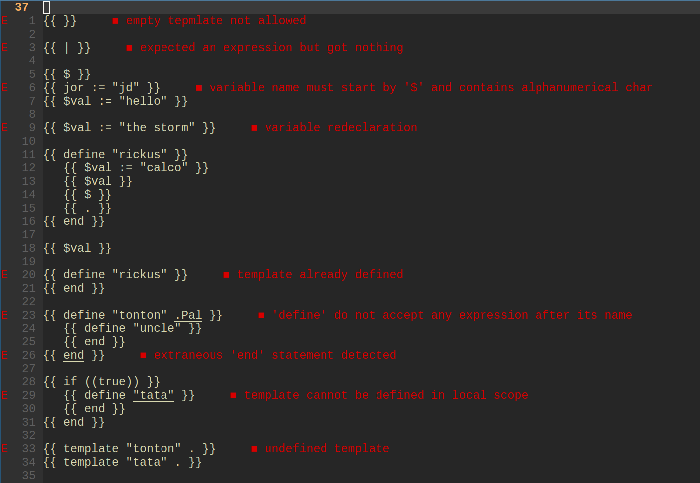

# Go Template LSP

## Overview

Go template is incredible. But the lack of editor/IDE support is a crime. This makes the feedback loop between coding and bug detection a real challenge.

This project (GO Template LSP) aim to tackle that issue. From now, instantaneous diagnostics and type checking are a breeze.

You will never again need to download a dependency to replace the good old and trusty Go Template package.

Below is an early version of the LSP in action (diagnostics)



## Install

First you will need to compile the project

```bash
git clone https://github.com/yayolande/gota
cd gota
go build
```

Once the executable compiled, you need to follow instructions related to your particular text editor/IDE to use it.
In my case, I am a Neovim enjoyer, so here is the code to include in your `init.lua`

```lua
local function start_go_template_lsp(capabilities)
	vim.api.nvim_create_autocmd("FileType", {
		pattern = "html",
		callback = function(args)
			vim.lsp.start({
				name = "gota-lsp",
				cmd = { "path_to_gota_executable" },
				capabilities = capabilities,
				-- root_dir = vim.fn.getcwd(),
				root_dir = vim.fs.root(args.buf, { 'go.mod' }),
			})
		end,
	})
end

local cmp = require("cmp")
cmp.setup({
    sources = {
        { name = 'nvim_lsp' },
    },
})

local capabilities = require('cmp_nvim_lsp').default_capabilities()
start_go_template_lsp(capabilities)

```

**NB:** For the example above, the LSP will only be launched whenever an 'html' is opened within a GO project. To change it, look at `pattern` and `root_dir` properties
**NB:** Install procedure for VS code is planed for when the project will reach maturity

## Usage

Just type your go template code, and you will see the magic
